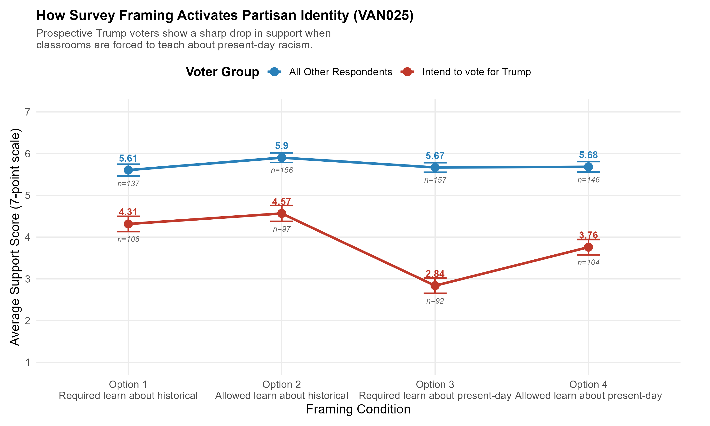

# How Survey Framing and Partisan Identity Shape American Views on Race in Education

A data report written for GOVT 394, Directed Research in William & Mary's Public Opinion Polling Lab (Spring 2026).

**[Read the full report (PDF, 5 pages)](race_education_data_report.pdf)**

## Findings

The report uses three national surveys with 5,883 respondents in total. It asks what drives American opinion on teaching race in K-12 schools. Across all three surveys, wording and party identity mattered more than the policy details themselves.

- **Question wording (CCES 2023):** in a randomized wording experiment, average support ranged from 5.39 ("allowed" to learn history) to 4.62 ("required" to learn about present-day racism) on a 7-point scale. Trump voters drove that 0.77-point gap: their support fell 1.73 points (4.57 to 2.84), while the rest of the sample stayed between 5.61 and 5.9.
- **Anti-CRT laws (VAND0049):** 59.5% of respondents opposed laws banning critical race theory. Beliefs about what schools are for predicted a respondent's stance better than demographics did, and Republican identity strengthened support for the bans.
- **BLM support (RPS Wave 1):** 65.6% supported the movement. Respondents' answers about what they teach their own children predicted support in both directions. Teaching about White privilege had the largest positive coefficient (+0.153). Teaching that Black people should be more respectful toward police had the largest negative one (-0.158).

## Methods

I analyzed all three surveys in R with OLS regression after removing non-response codes. All estimates are unweighted.

## Repository contents

| Path | Contents |
| --- | --- |
| `race_education_data_report.pdf` | The full report |
| `analysis/01_survey_analysis.R` | Summary statistics and regressions for all three surveys |
| `analysis/02_figures_framing_and_crt.R` | Figures 2 and 3 (framing interaction, anti-CRT stance by party) |
| `analysis/03_figures_blm.R` | Figure 4 (parental socialization coefficients for BLM support) |
| `figures/` | The figures used in the report |

## Data

The survey data were collected by Allison Anoll, Andrew Engelhardt and Mackenzie Israel-Trummel. They are not included in this repository. To rerun the scripts, put the data files in a local `data/` folder at the repository root, using the file names the scripts reference.

## Author

Yibarek Tadesse, B.S. Computer Science, William & Mary (2026)
